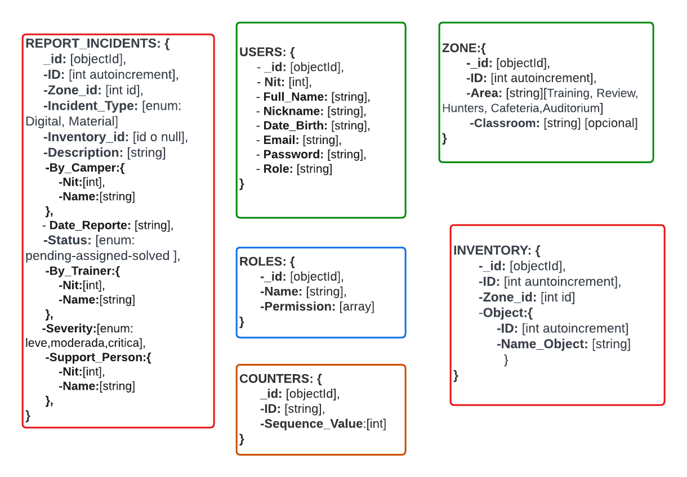
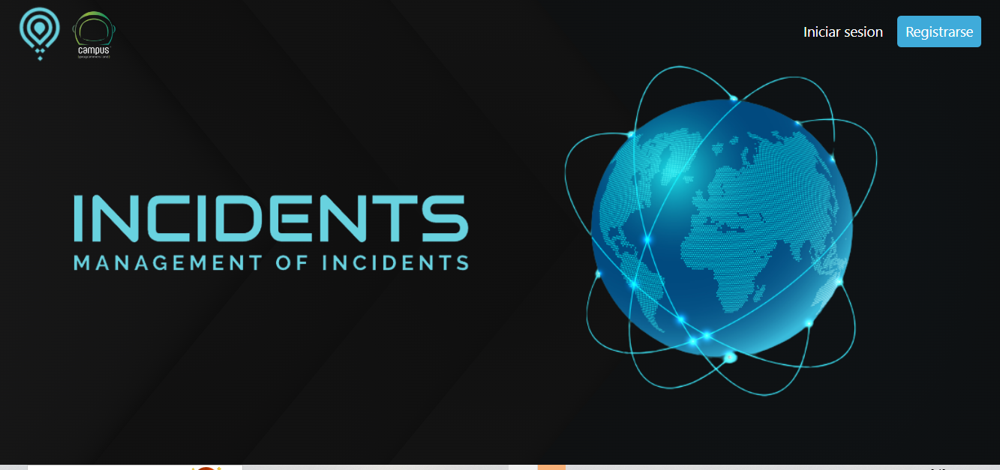
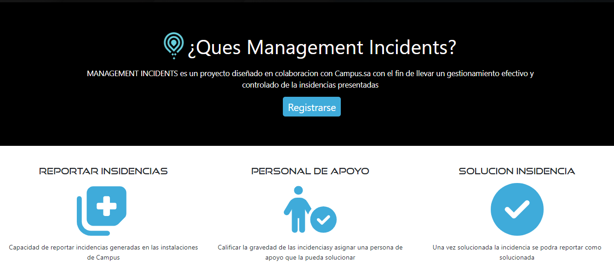
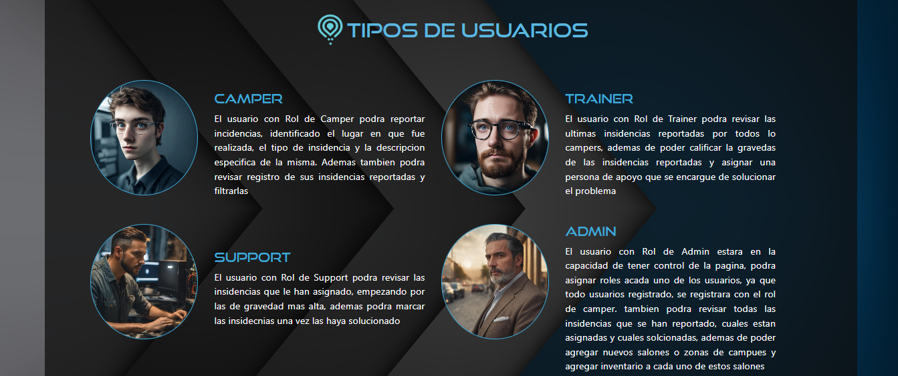
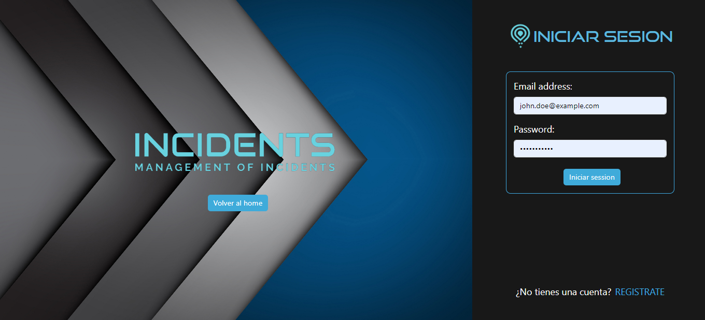
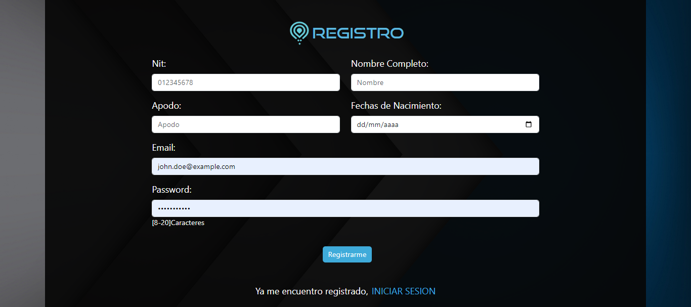
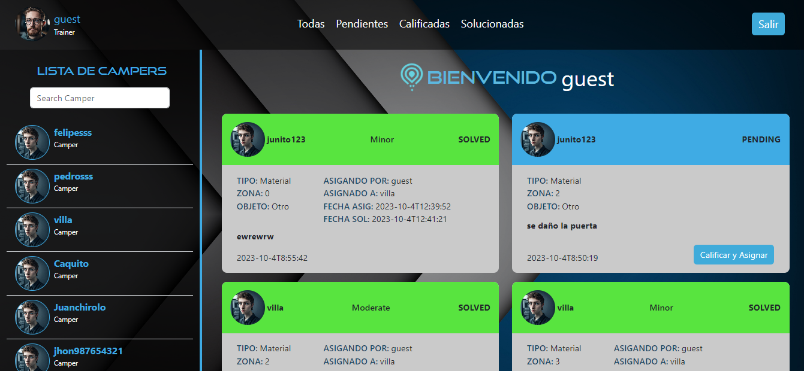
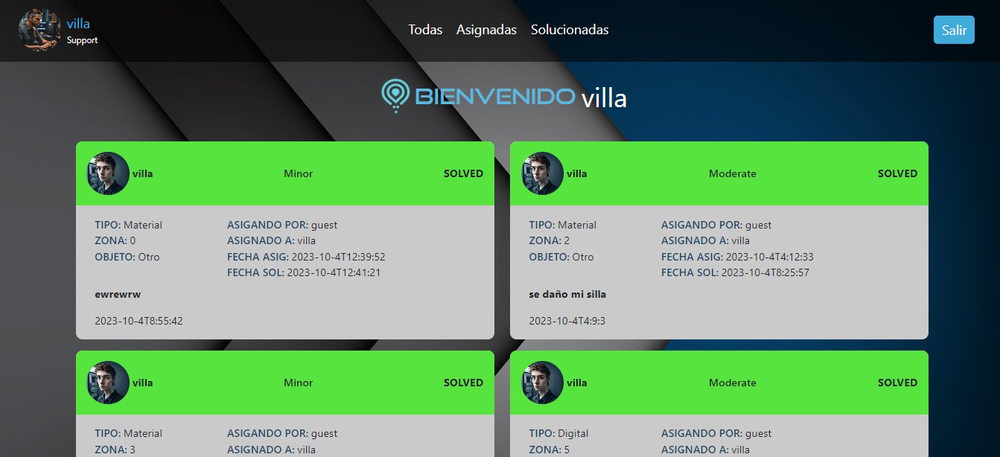
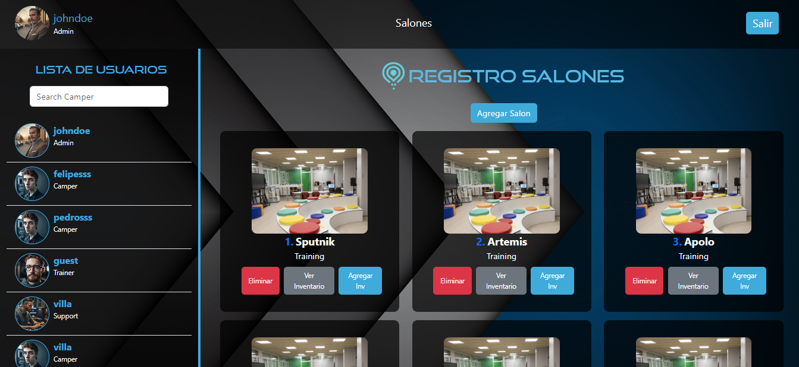

# MANAGEMENT INCIDENTS

## Objetivo Principal

El objetivo general de la aplicacion es desarrollar un sistema de gestión de incidentes que permita a los Campers reportar cualquier incidente que ocurra en las instalaciones, ya sea de tipo MATERIAL o DIGITAL. Este sistema permitirá a los Campers reportar fácilmente las incidencias que encuentren, y permitir a los Trainers calificar la gravedad de las mismas y poder asignar una persona de apoyo que resuelva los problemas de manera rápida y eficiente.

## Objetivos Especificos

- Permitir a los Campers reportar incidentes de manera fácil y rápida
  - Desarrollar una interfaz de usuario que sea fácil de entender y usar para los campistas.
- Permitir a los Trainers revisar los incidentes reportados y calificar su gravedad
  - Desarrollar un sistema de clasificación de incidentes que sea claro y fácil de usar.
  - Proporcionar a los instructores la información que necesitan para calificar la gravedad de los incidentes.
- Permitir a los Trainers asignar un personal de apoyo para resolver los incidentes
  - Desarrollar un sistema de asignación de incidentes que sea eficiente y eficaz.
  - Proporcionar a los Trainers la información que necesitan para asignar los incidentes al personal de apoyo adecuado.

## Diagrama DB

## CONSULTAS Y ENDPOINTS A UTILIZAR

El Backend de este aplicativo estará desarrollado con express y la base de datos con mongoDB, estos nos ayudarán a cumplir con los objetivos que queremos alcanzar del lado del servidor, para ello contaremos con los siguientes Endpoints:

1. Listar todos los incidentes dependiendo el status (Camper)

``http://"host":"port"/incidents/ordenados?status=Pending``

2. Listar todos los incidentes reportados por un Camper específico (Camper)

``   http://"host":"port"/incidents?rol=Camper&nit=111111111
``

3. Listar todos los incidentes de tipo Material  (Camper)

``   http://"host":"port"/incidents/Material
``
4. Listar todos los incidentes de tipo material de una usuario especifico

``   http://"host":"port"/incidents/Material?rol=Camper&nit=1005688571
``
5. Listar todos los incidentes calificados y Assignados por un Trainer especifico (Trainer)

``   http://"host":"port"/incidents?rol=Trainer&nit=111111111
``
6. Listar todos los incidentes Digitales (Camper)

``   http://"host":"port"/incidents/Digital?nit=1006654874
``
7. Listar todos los incidentes de tipo Digital de una usuario especifico

``   http://"host":"port"/incidents/Digital?rol=Camper&nit=1005688571
``
8. Listar todos los incidentes reportados en un area especifica

``   http://"host":"port"/incidents/Area?nameArea=Training
``
9. Listar todos los incidentes reportados en un area especifica por un camper especifico

``   http://"host":"port"/incidents/Area?nameArea=Training&nit=1005688571
``
10. Listar todos los incidentes reportados en un classroom especifico

``    http://"host":"port"/incidents/Classroom?nameClassroom=Sputnik
``
11. Listar las incidentes Asignados a un personal de apoyo especifico

``    http://"host":"port"/incidents/Assigned?supportNit=123132
``
12. Listar las incidentes Solucionados un personal de apoyo especifico

``    http://"host":"port"/incidents/Solved?supportNit=1213
``
13. Listar todos los incidentes dependiendo el status, del rol y el nit del usuario (TODOS)

``    http://"host":"port"/incidents/ordenados?status=Solved&rol=Support&nit=1099458682
``
14. Reportar incidentes (POST)

``    http://"host":"port"/incidents/
``

15. Modificar incidentes (PUT)

``    http://"host":"port"/incidents:id
``
16. Que los Trainers puedan Modificar incidentes ASSIGNADOS (PUT)

``    http://"host":"port"/incidents/Assign/:id
``
17. Que los Support puedan Modificar incidentes SOLVED (PUT)

``    http://"host":"port"/incidents/Solved/:id
``

18. Campers puedan eliminar un incidente

``    http://"host":"port"/incidents/:id
``
    //USERS

19. Listar Todos los usuarios 

``    http://"host":"port"/users
``
20. listar los usuarios dependiendo del rol

``    http://"host":"port"/users?rol=Camper
``
21. Crear un buscador para los usuarios

``    http://"host":"port"/users/SearchGeneral?text=vill
``
22. Crear un buscador para Campers, Trainers y Support

``    http://"host":"port"/users/Search?rol=Camper&text=pe
``
23. Registrar usuarios

``    http://"host":"port"/users
``
24. Modificar información de usuarios

``    http://"host":"port"/users?nit=100599968
``
25. cambiar el rol de un usuario

``    http://"host":"port"/users/Role?nit=1005999685
``

26. Listar todas las areas

``    http://"host":"port"/zones/Area
``
27. obtener una zona especifica

``    http://"host":"port"/zones?id=1
``

28. listar las salones por nombre de area

``    http://"host":"port"/zones/Classroom?nameArea=Training
``
29. Agregar un nuevo salon

``    http://"host":"port"/zones
``

30. Modificar un salon

``    http://"host":"port"/zones?id=1
``
31. eliminar un salon

``    http://"host":"port"/zones?id=1
``

32. Obtener el inventario de una zona especifica

``    http://"host":"port"/inventory?zoneId=1
``
33. agregar un nuevo objeto al inventario de una zona

``    http://"host":"port"/inventory
``

34. Modificar un inventario

``    http://"host":"port"/inventory?id=1
``
35. Eliminar un inventario

``    http://"host":"port"/inventory?id=1
``    

### Nota Importante

Queda claro que estos endpoints y consultas son pensados con el fin de seguir escalando y modificando la aplicativa, como primera versión no utilizaremos todos los endpoints, si no los más necesarios para alcanzar el objetivo que queremos lograr.

## FUNCIONAMIENTO E INTERFAZ

Management Incidents contará con una interfaz sencilla, realizada con la herramienta de React, React nos brindará herramientas que nos permitirán crear el interfaz de la página de una manera más eficaz y organizada, como por ejemplo utilizaremos la dependencia de react-router-dom con la que podremos controlar las rutas de nuestra página y también privatizarlas dependiendo el rol del usuario creado, además nos apoyaremos en la biblioteca de Bootstrap para que la aplicación de estilo y diseño sea más amena con el entorno de la aplicación, entre muchas otras bibliotecas.

A continuación nos encontraremos con la explicación de la interfaz de cada una de las rutas:

1. ### Home page 

   Al ingresar a la página nos encontraremos el siguiente interfaz:

   

   En este interfaz podemos ver un banner principal con el título y logo de la aplicación, además de un header, con un icono y los dos botones de Inicio de sesión y de Registrarse 

   

   Al bajar un poco, nos encontraremos con una sección donde explicamos detalladamente el objetivo de nuestra aplicación, además de otro button que nos redireccionará a la página de registro.

   

   En la siguiente sección nos encontraremos con información sobre los tipos de usuario que tendrán acceso a nuestra aplicación, explicando detalladamente la función y actividades que desarrollara cada uno.

   

   Finalmente, nos encontraremos con un footer con información del desarrollador encargado de la creación de la página.

  

2. ### Log in

   Como segundo interfaz tenemos un interfaz sencillo de inicio de sesión, del cual podemos hacer uso para poder ingresar a la página, una vez nos hayamos registrado, en caso de no habernos registrado, este interfaz contará con un link en la parte inferior, que nos redireccionará a la interfaz en la que podemos registrarnos.

     

3. ### Sign up

   Como tercer interfaz, nos encontramos con un formulario para realizar el registro de usuario en caso de no tener un usuario registrado. Esta interfaz también tendrá un link en su parte inferior, que en caso de ya estar logueados nos redireccione al interfaz de inicio de sesión.

  

   **Importante**

   Debemos tener en cuenta, que una vez registrados y logeados, siempre por defecto. tendremos el rol de camper y el único encargado de poder cambiarlo será el admin.

4. ### Interfaz camper

   Esta interfaz contará con un header donde podremos ver el logo y nickname del usuario logeado, también un menú por el cuál podremos navegar, para filtrar la información del body, en la parte final del header, nos encontraremos con un botón de salir, el cual podremos usar para cerrar sesión de la página 

   En el cuerpo del interfaz podremos ver todas las incidencias reportadas por ese usuario, al igual que podremos hacer uso del botón ubicado en la esquina inferior derecha, que nos abrirá un modal el cual nos permitirá gestionar el reporte de alguna nueva incidencia.

     
   

5. ### Interfaz trainer

   Está es la interfaz que veremos en caso de tener el rol de trainer, esta interfaz tendrá un header muy similar al del camper, en el body, nos encontraremos con todas las incidencias reportadas por los campers, también podremos hacer uso de el menú de la parte superior para filtrar esas incidencias. 

   Como plus, adicional tendremos un menú donde tendremos información de todos los campers registrados y las incidencias reportadas por estos.

   La actividad que destaca al usuario trainer, es que tendrá la capacidad de calificar la gravedad de ls incidencias pendientes y asignar un personal de apoyo que se encargará de solucionarlas.

      
   

6. ### Interfaz personal de apoyo

   Esta será la interfaz que verán los usuarios con el rol de Support, mantendremos el header similar, modificando el menú de filtrado, ya que los usuarios support solo tendrán acceso a ver las incidencias que les asignaron a solucionar a ellos, además de tener la tarea, de una vez solucionada dicha incidencia, calificarla como solucionada.

      

7. ### Interfaz de admin

   La interfaz de admin, o la más importante es a la que podemos acceder solo si somos Admin, está es la encargada de asignar roles, crear áreas y salones de clase, admás de llevar un inventario por cada salón de campus, entonces se podría decir que el interfaz de admin, es el encargado del correcto funcionamiento de la aplicación   

      

### Nota importante

Debemos tener en cuenta que esta es la versión 1 o primer diseño de lo que sería nuestra aplicación, no se encuentra del todo terminada, pero el objetivo es poder seguir versionándola, para acercarnos más al objetivo específico que tenemos. 

## CONTACT

Nombre: Carlos Villafrades Pinilla

Email: [cavillafrades@gmail.com](mailto:cavillafrades@gmail.com)